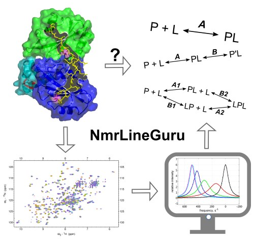

# NmrLineGuru (Ver 2.1)

Standalone and User-Friendly GUIs for Fast 1D NMR Lineshape Simulation and Analysis with Multi-State Equilibrium Binding Models

Chao Feng, Ph.D., Nov 2019

## Version History

2.0 --> 2.1

* Allow using Hertz or rad/s as the frequency unit of fitting input data. Previously only support rad/s.
* Allow adding more constrains to reduce the number of fitting parameters when fitting the 3- and 4-state models. See our Wiki for examples in the tutorials.
* Add official contact, citation, and license information.

1.1 --> 2.0

* Add fitting GUIs for 2-, 3-, and 4-state models
* Fix bugs and update default parameter values
* Include MCR in the installation packages

1.0 --> 1.1

* Bug fix for the GUI starting problem
* A zipped installation file is added for Unix platform

## Introduction

**Nuclear magnetic resonance (NMR) spectroscopy** is a powerful tool for studying protein interactions. The **residue-level** resolution enables the study of dynamics and kinetics of individual binding steps in a multi-state equilibrium for multi-domain proteins. 

This type of study is not very possible for other biophysical methods (e.g. isothermal titration calorimetry, surface plasmon resonance, or fluorescence titration), which are  based on only a single readout of the **whole molecule**.

However, it's often technically difficult to analyze the NMR lineshape data obtained from a titration experiment involving multi-state equilibrium for multi-domain proteins due to the following reasons:

* Multi-state equilibrium involves complex math models
* Fitting NMR lineshape data involves not only equilibrium models but also kinetic models relating with NMR lineshape theory and matrices
* Most existing tools for fitting NMR lineshape data require full installation of MATLAB and other dependencies, lack user-friendly GUIs, require programming knowledge to edit setup scripts, and can only support the simplest 2-state binding model

In the past years, We've been studying the dynamics of Syk tandem SH2 (tSH2) domains and Syk tSH2 interactions with dp-ITAM peptides. NMR lineshape analysis was used to investigate the dynamics and kinetics of each step in the related multi-state equilibrium:

> Feng C, Post CB (2016) Insights into the allosteric regulation of Syk association with receptor ITAM, a multi-state equilibrium. Phys Chem Chem Phys 18:5807–5818. 
<a target="_blank" href="https://doi.org/10.1039/c5cp05417f">[DOI]</a> 

> Feng C, Kovrigin EL, Post CB (2019) NmrLineGuru: Standalone and User-Friendly GUIs for Fast 1D NMR Lineshape Simulation and Analysis of Multi-State Equilibrium Binding Models. Scientific Reports 9:16023.
<a target="_blank" href="https://doi.org/10.1038/s41598-019-52451-8">[DOI]</a>

During the study, several binding models were built mathematically and a batch of MATLAB code was developed to simulate/fit NMR lineshape data.

To help others dealing with similar research questions, we made a standalone and graphical user interface (GUI) based user-friendly tool: **NmrLineGuru**. 

## Platform and Installation

The current version of NmrLineGuru contains 6 GUIs to simulate or fit NMR lineshape data for 2-state, 3-state, and 4-state binding models. More GUIs may be added in future releases.

We provide compiled installation files for two platforms:

* 64-bit version for Windows.
* 64-bit version for Linux. Ubuntu Linux is preferred but it should also work on other Linux releases. 

Please download and run the correct install file. During installation, please follow the on-screen prompts to install the software. This software requires the free MATLAB Compiler Runtime (MCR) version 8.3 (R2014a). If your system doesn't have MCR 8.3, the installer will prompt to install it as well.

**For Windows users:**

+ Download and execute **<a target="_blank" href="https://forms.gle/pTGjZG1vS1rHyJas8">NmrLineGuru_2.1_Windows.exe</a>**, the 64-bit version for windows.
+ During installation, select the option to create a shortcut for NmrLineGuru on the desktop. 
+ After installation, click the shortcut to start the program.

**For Linux users**:

+ Download and execute **<a target="_blank" href="https://forms.gle/pTGjZG1vS1rHyJas8">NmrLineGuru_2.1_Linux.install</a>**, the 64-bit version for Linux.
+ During installation, please keep a note of the install path for both NmrLineGuru and MCR. You can install them to anywhere you like. 
+ After installation, run the following command in a shell to start NmrLineGuru:   
  `{NmrLineGuru_Root}/application/run_NmrLineGuru.sh  {MCR_Root}/v83`   
  For example, you installed NmrLineGuru in */home/chao/NmrLineGuru* and MCR in */home/chao/mcr*. So the command line to start NmrLineGuru should be:   
  `/home/chao/NmrLineGuru/application/run_NmrLineGuru.sh  /home/chao/mcr/v83`   
  You may optionally add an alias for this command in the shell starting script. Search *Linux shell alias* for how-to.
+ Note: the Linux version was tested on Ubuntu 18.04. If you use a different Linux release and experience problems of displaying or running the software, please try to install Ubuntu 18.04 in a physical or virtual machine and then install the software in it.  

**NmrLineGuru on NMRbox**:

+ `NmrLineGuru` is pre-installed on all NMRbox virtual machines (see <a target="_blank" href="https://nmrbox.org">nmrbox.org</a>). Once you are connected to a NMRbox virtual machine, you can simply open a Linux terminal window and type  command **NmrLineGuru** to run `NmrLineGuru`.  
+ You can either connect to a cloud-based NMRbox virtual machine via remote desktop, or download the virtual machine file and run it locally. Please check <a target="_blank" href="https://nmrbox.org">nmrbox.org</a> for more details.

## Main Startup Interface 

After starting the software, a GUI selector will appear:

You'll need to select the binding model and action (simulate or fit). Then, the corresponding GUI will appear to simulate or fit NMR lineshape data with the specified model.

## Tutorials and User Guide

**Please carefully check the NmrLineGuru Wiki for tutorials, examples, and answers for common questions:**   
<a target="_blank" href="https://github.com/stonefonly/NmrLineGuru/wiki">https://github.com/stonefonly/NmrLineGuru/wiki</a>  

## Citation, License, and Contact

Copyright 2019 Purdue University All Rights Reserved.

**For academic use**, please cite the following references if you used this software for your research or presentation. Your citation is the driving force for us to keep this tool online and work on future releases!

> Feng C, Kovrigin EL, Post CB (2019) NmrLineGuru: Standalone and User-Friendly GUIs for Fast 1D NMR Lineshape Simulation and Analysis of Multi-State Equilibrium Binding Models. Scientific Reports 9:16023.
<a target="_blank" href="https://doi.org/10.1038/s41598-019-52451-8">[DOI]</a>

> Feng C, Post CB (2016) Insights into the allosteric regulation of Syk association with receptor ITAM, a multi-state equilibrium. Phys Chem Chem Phys 18:5807–5818. 
<a target="_blank" href="https://doi.org/10.1039/c5cp05417f">[DOI]</a> 

Purdue University hereby grants you a limited, personal, revocable, nonexclusive, nonassignable, license and right to access and use NmrLineGuru as an end-user solely for your educational, academic, and scholarly endeavors. All commercial uses are excluded from this grant.

**For commercial use**, please contact us at otcip@prf.org to obtain a license.

Please email me (ustcfy '[AT]' gmail '[DOT]' com) if you have suggestions or need consulting service. 
