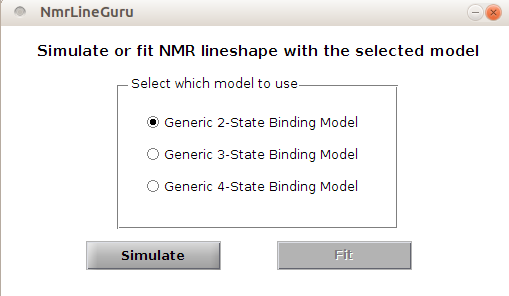
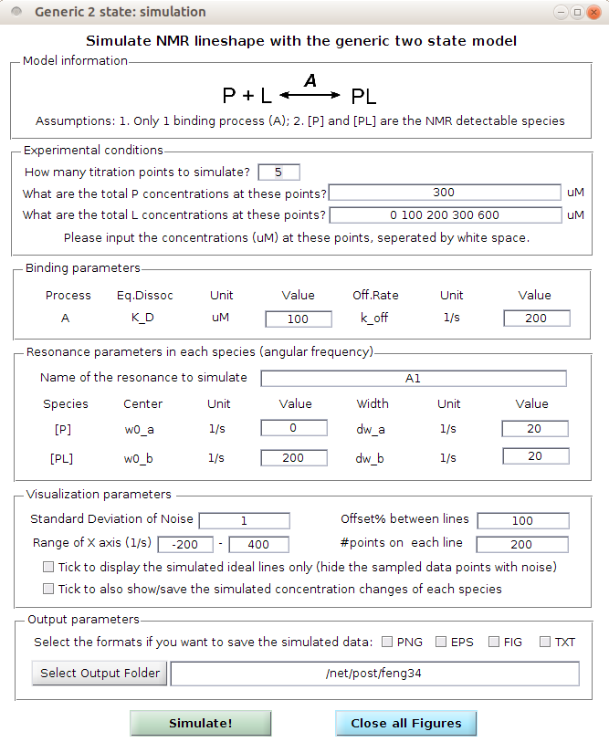
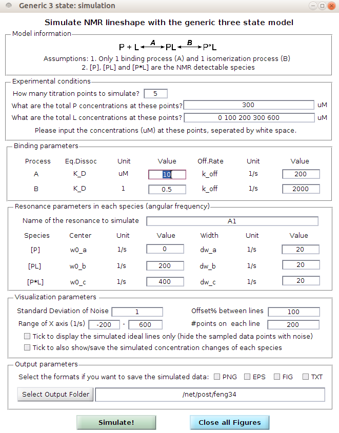
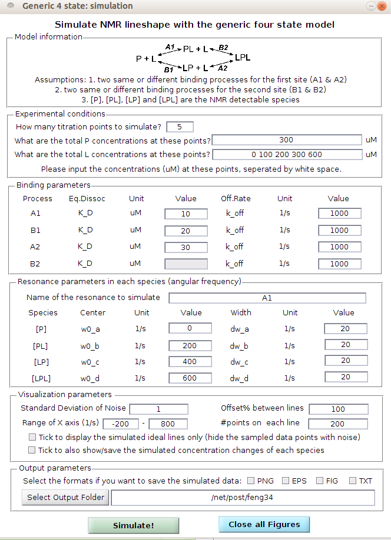

# NmrLineGuru (Ver 1.0)  
*Chao Feng, Mar 19, 2017*

A graphical user interface (GUI) based user-friendly tool to simulate and fit NMR line shapes with multi-state equilibrium models.

### Introduction
**Nuclear magnetic resonance (NMR) spectroscopy** is a powerful tool for studying protein interactions. The **residue-level** resolution enables the study of dynamics and kinetics of individual binding steps in a multi-state equilibrium for multi-domain proteins. 

This type of study is not very possible for other biophysical methods (e.g. isothermal titration calorimetry, surface plasmon resonance, or fluorescence titration), which are  based on only a single readout of the **whole molecule**.

However, it's often technically difficult to analyze the NMR line shape data obtained from a titration experiment involving multi-state equilibria for multi-domain proteins due to the following reasons:

* Multi-state equilibria involve complex math models
* Fitting NMR line shape data involves not only equilibrium models but also kinetic models relating with NMR line shape theory and matrices
* Most existing tools for fitting NMR line shape data can only support the simplest 2-state binding model

In the past years, We've been studying the dynamics of Syk tandem SH2 (tSH2) domains and Syk tSH2 interactions with dp-ITAM peptides. NMR line shape analysis was used to investigate the dynamics and kinetics of each step in the related multi-state equlibrium:

**C Feng and CB Post (2016). Insights into the allosteric regulation of Syk association with receptor ITAM, a multi-state equilibrium. Physical Chemistry Chemical Physics 18 (8), 5807-5818. [[PDF]](https://drive.google.com/open?id=0B3uitI9T92-gaDhDdDU5WDhoT1U)**

During the study, several binding models were built mathematically  and a batch of Matlab code was developed to simulate/fit NMR line shape data.

To help other scientists dealing with similar research questions, We plan to turn the code into a graphical user interface (GUI) based user-friendly tool: **NmrLineGuru**. 

### Version and Installation
The current version (1.0) of NmrLineGuru contains 3 simulation GUIs for 2-state, 3-state, and 4-state binding models. More GUIs will be added gradually in future releases.

We provide compiled installation files for two platforms:

* NmrLineGuru-1.0-Win64.exe:  64-bit version for windows.
* NmrLineGuru-1.0-Unix64.bin: 64-bit version for Unix. Ubuntu linux is preferred but it should also work on other linux or unix releases including macOS. Please let us know if you notice an incompatibility issue.

Please download the correct version and execute the install file. During installation, please follow the on-screen prompts to install the software. This software depends on MATLAB Compiler Runtime (MCR) version 8.3 (R2014a). If your system doesn't have MCR 8.3 (R2014a), you'll be prompted to install it. MCR is free to download and use.

### Interface and Functions
For windows users, a shortcut on desktop will be created after installation. 

For Unix users, please download and follow **"NmrLineGuru-1.0-Unix64.notes"** to run the program after installation.

After starting the software, a model selector will appear:

*model/action selector*

You'll need to select the binding model and action (simulate or fit). Then, another GUI will appear for simulating/fitting with the specified model. Currently, we have the following GUIs:

*2-state simulation*

  

*3-state simulation*

  

*4-state simulation*

  

Each GUI is pretty self-explanatory. It shows the model, model assumptions, and exemplary input parameters. You can try it immediately with these parameters or change them as you want.

### Citation and Contact Info
Please cite the following references if you used this software for your research or presentation:

**C Feng and CB Post (2016). Insights into the allosteric regulation of Syk association with receptor ITAM, a multi-state equilibrium. Physical Chemistry Chemical Physics 18 (8), 5807-5818. [[PDF]](https://drive.google.com/open?id=0B3uitI9T92-gaDhDdDU5WDhoT1U)**

Another manuscript is in preparation.

Your citation is the driving force for us to work on future releases and keep this tool online!

Please email us (cbp AT purdue DOT edu) if you have any questions or suggestions. Thanks in advance!
